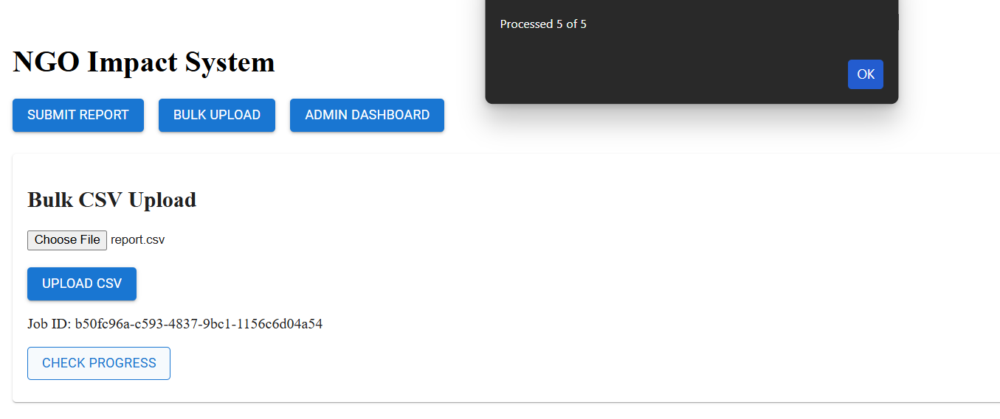
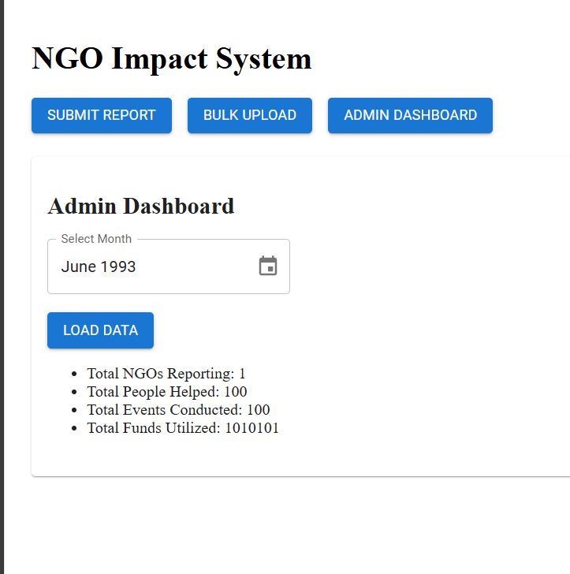

# ngo-impact-reporting-system
A full-stack MERN application that enables NGOs to submit monthly impact reports (single or bulk CSV) and provides an admin dashboard with aggregated insights, asynchronous processing, and idempotent data handling.

1.Overview:
This is a full-stack web application that allows NGOs to submit monthly impact reports (individually or via bulk CSV upload) and enables admins to view  data through a dashboard.
The system is designed to handle bulk uploads asynchronously.

2.Tech Stack
Frontend:
React (Vite)
Material UI (MUI)
Axios
Day.js (for calendar/month picker)

Backend:
Node.js
Express.js
MongoDB
Mongoose
Multer (CSV upload)
csv-parser
UUID

3.Database
MongoDB (local)

4.Backend setup:
cd backend
npm install
npm run dev
Backend will start running on:http://localhost:5000

MongoDb connection:mongodb://localhost:27017/ngo-impact

5.Frontend Setup:
cd frontend
npm install
npm run dev
Frontend will start running on:http://localhost:5173

6.API Endpoints:

i. Submit Single Report:
API---POST /api/report
{
  "ngoId": "NGO001",
  "month": "2025-01",
  "peopleHelped": 120,
  "eventsConducted": 4,
  "fundsUtilized": 50000
}

ii. Bulk CSV Upload (Async) example::
API--POST /api/reports/upload
ngoId,month,peopleHelped,eventsConducted,fundsUtilized
NGO001,2025-01,120,4,50000
NGO002,2025-01,80,2,30000

Response:

{
  "jobId": "uuid-value"
}

iii. Job Status

API--GET /api/job-status/{jobId}

{
  "jobId": "...",
  "processed": 2,
  "total": 5,
  "status": "processing"
}

iv. Admin Dashboard

API--GET /api/dashboard?month=YYYY-MM

{
  "totalNGOs": 2,
  "totalPeopleHelped": 200,
  "totalEventsConducted": 6,
  "totalFundsUtilized": 80000
}

7.UI SCREEN DESCRIPTION:
i.Submit Report Page:
NGO ID input
Month selector (calendar)
Metrics input
Submit button

ii.Bulk Upload Page
CSV file upload
Job ID generation
Job progress polling
Admin Dashboard

iii.Month selector (calendar)
Aggregated metrics view

BELOW IS THE SCREENSHOT THE UI WHICH I MADE:

Mongodb pics:

